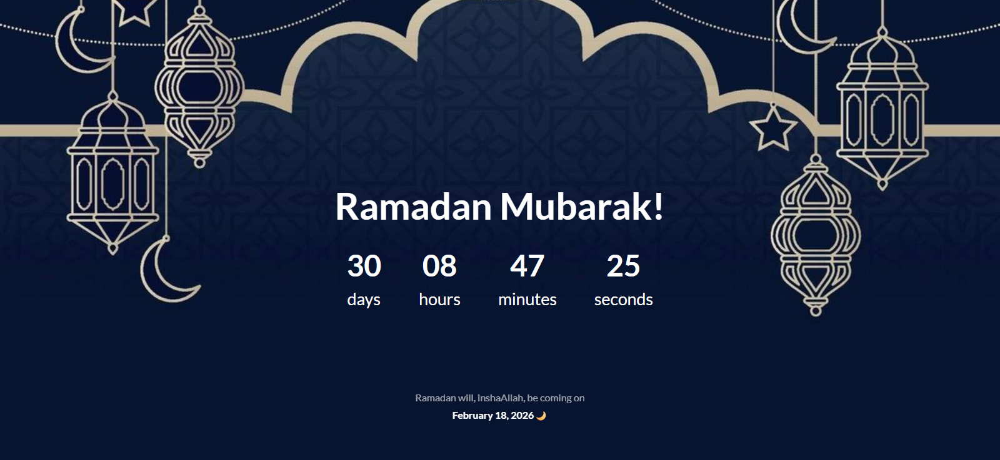

# Ramadan Countdown ⏳🌙

A simple JavaScript project that counts down the remaining time until the start of Ramadan 🌙

## Built With

- HTML
- CSS
- JavaScript (Vanilla JS)

## Features

- Live countdown (days, hours, minutes, seconds)
- Updates every second
- Simple loading screen

## What I Learned

- JavaScript Date object
- Time calculations
- DOM manipulation
- setInterval & setTimeout

## Live Demo

[Ramadan Countdown 🎉](https://omartarekll.github.io/Ramadan-Countdown/)

## Screenshot

